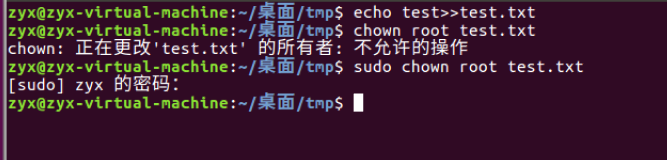
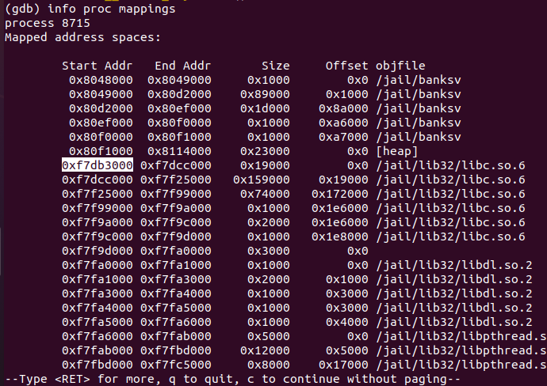
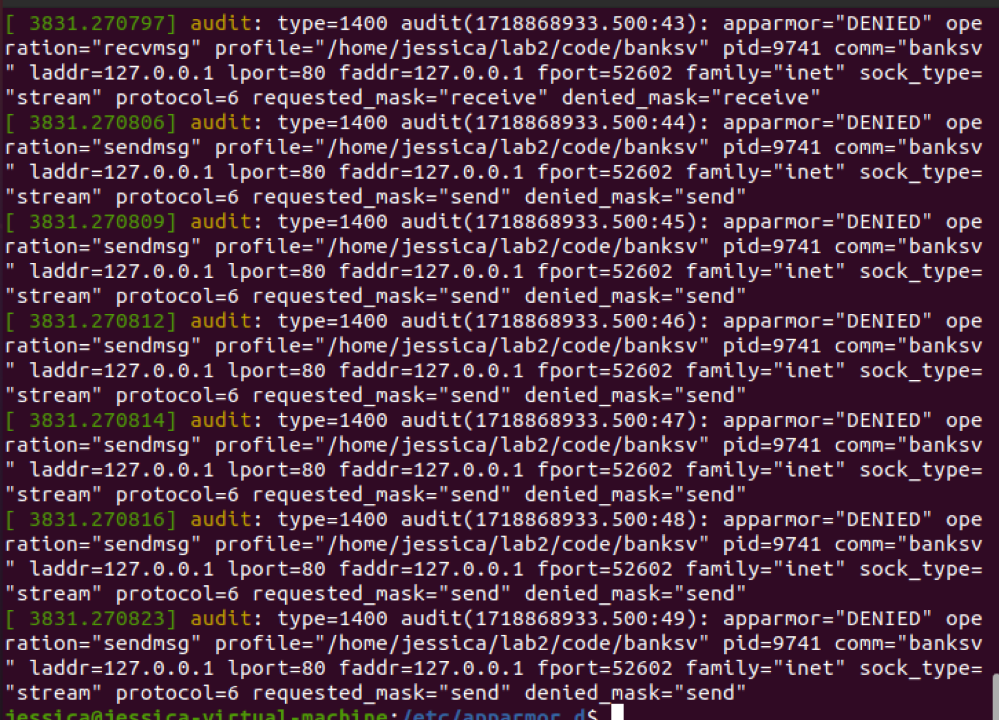

## 任务一二 chroot

关闭地址随机化：sudo sysctl -w kernel.randomize_va_space=0

```
sudo chown root touchstone
sudo chmod +s touchstone
./touchstone
```


zyx	123456


```
echo test>>test.txt
sudo chown root test.txt
```



​	

```
ldd banksv

```

libc.so.6 => /lib32/libc.so.6 (0xf7da0000)

通过 ldd banksv 查到 libc_base 为 0xf7da0000

```
readelf -s /lib32/libc.so.6 |grep "system"
readelf -s /lib32/libc.so.6 |grep "exit"
readelf -s /lib32/libc.so.6 |grep "unlink"
```

   1537: 00041360    63 FUNC    WEAK   DEFAULT   15 system@@GLIBC_2.0

   150: 00033ec0    39 FUNC    GLOBAL DEFAULT   15 exit@@GLIBC_2.0

   534: 000f29b0    36 FUNC    WEAK   DEFAULT   15 unlink@@GLIBC_2.0


```
strings -tx /lib32/libc.so.6 |grep "/bin/sh"
```

18c363 /bin/sh

### 子任务


0xf7db3000




## 任务三 euid


## 任务四 seccomp

```
sudo apt install libseccomp-dev libseccomp2 seccomp
sudo apt-get install libseccomp-dev:i386
```

修改banksv.c

```
//默认拒绝，显示允许
  ctx=seccomp_init(SCMP_ACT_KILL);
  
  //攻击程序需要的权限
  seccomp_rule_add(ctx,SCMP_ACT_ALLOW,SCMP_SYS(unlink),0);
```


```
ldd banksv
readelf -s /lib/i386-linux-gnu/libc.so.6 |grep "system"
readelf -s /lib/i386-linux-gnu/libc.so.6 |grep "exit"
readelf -s /lib/i386-linux-gnu/libc.so.6 |grep "unlink"
strings -tx /lib/i386-linux-gnu/libc.so.6  |grep "/bin/sh"
```

libc.so.6 => /lib/i386-linux-gnu/libc.so.6 (0xf7d7a000)

 1537: 00041780    63 FUNC    WEAK   DEFAULT   15 system@@GLIBC_2.0

 150: 000340c0    39 FUNC    GLOBAL DEFAULT   15 exit@@GLIBC_2.0


 534: 000f4100    36 FUNC    WEAK   DEFAULT   15 unlink@@GLIBC_2.0

 18e363 /bin/sh


```
python3 x01.py 127.0.0.1 80
```

## 任务五 apparmor

```
Last Modified: Thu Jun 20 14:16:24 2024

#include <tunables/global>

/home/jessica/lab2/code/banksv {
  #include <abstractions/base>
  #include <abstractions/apache2-common>
  /home/*/lab2/code/db/user.db rwk,
  /home/*/lab2/code/index.html r,
  /home/jessica/lab2/code/banksv mr,
  owner /home/*/lab2/code/db/user.db-journal w,
}
```

~                                                                              
~  

dmesg


